# 基于Springboot的中小型医院网站

## Springboot-0067


## 技术栈

Springboot mybatisplus vue mysql maven


## 数据库表(17张)


## 功能介绍

```properties
医师注册登录后主要功能模块包括个人中心、预约挂号管理、体检报告管理、医师开药管理以及用户取药管理。

管理员可登录系统后台对系统进行全面管理操作，管理员主要实现等功能模块包括个人中心、用户管理、医师管理、关于我们管理、科室类型管理、门诊信息管理、药库信息管理、缴费清单管理、药品类型管理以及系统管理。管理员实现了对系统信息的添加、修改和删除的功能。

用户在系统前台可查看系统信息，包括首页、门诊信息、药库信息、系统公告等，用户要想实现选择门诊预约挂号功能，就必须登录系统，没有账号的用户可首先进行注册操作，注册登录后主要功能模块包括个人中心、预约挂号管理、体检报告管理、医师开药管理、用户取药管理、缴费清单管理。


```


## 图片

### 前台


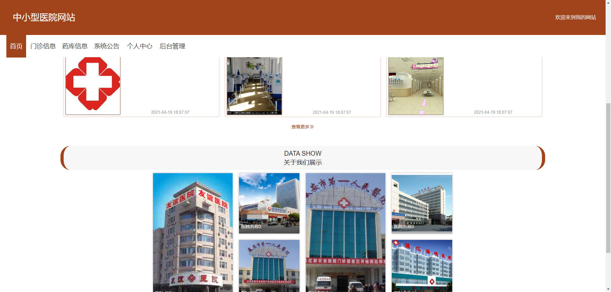

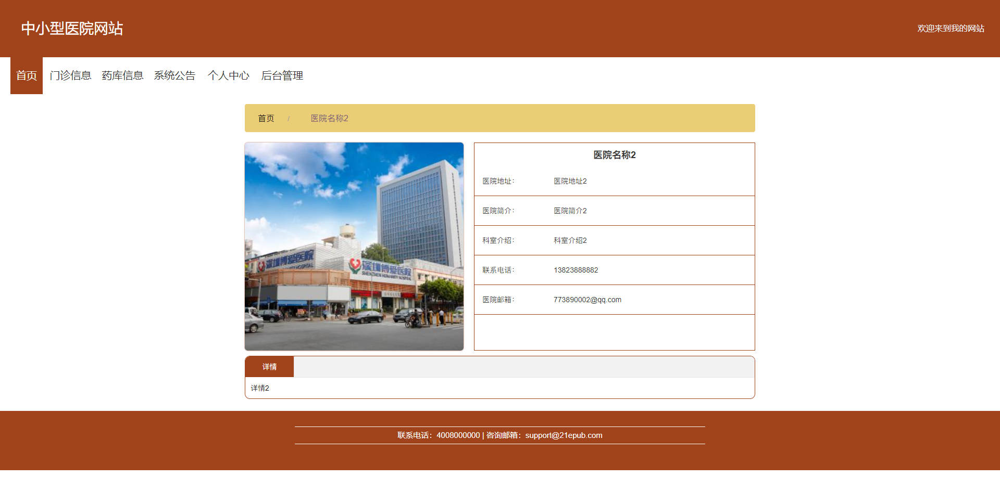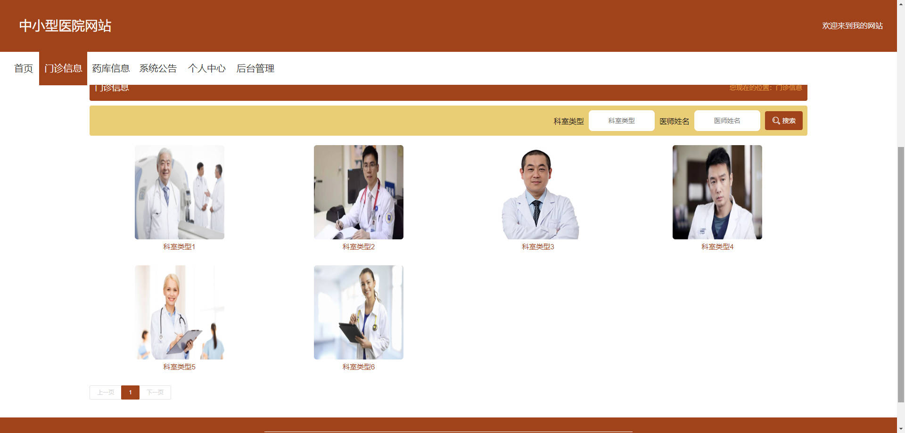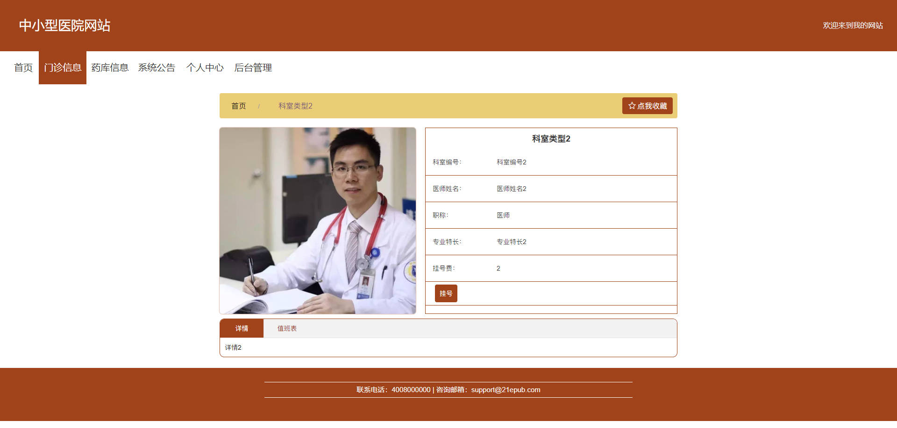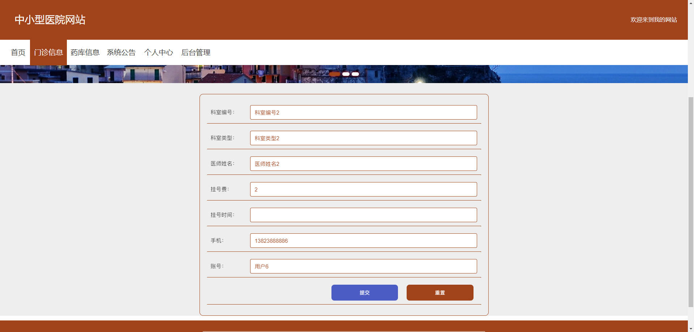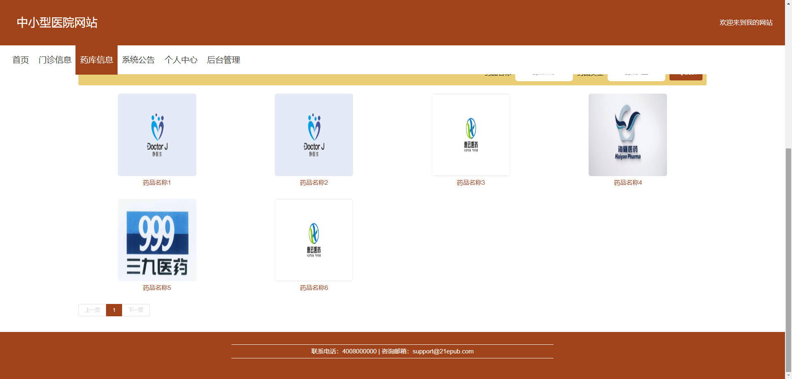

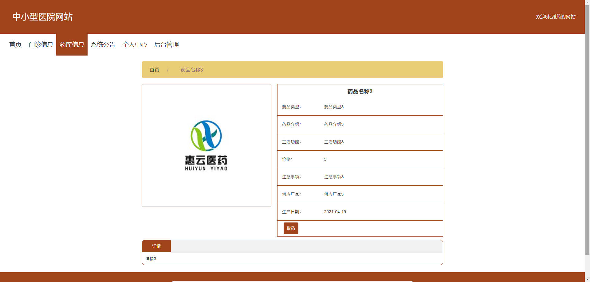

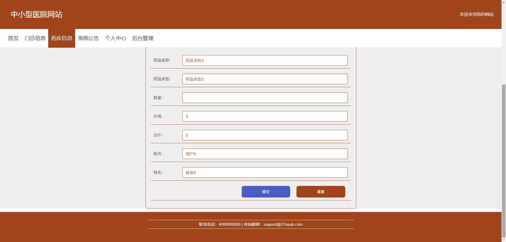

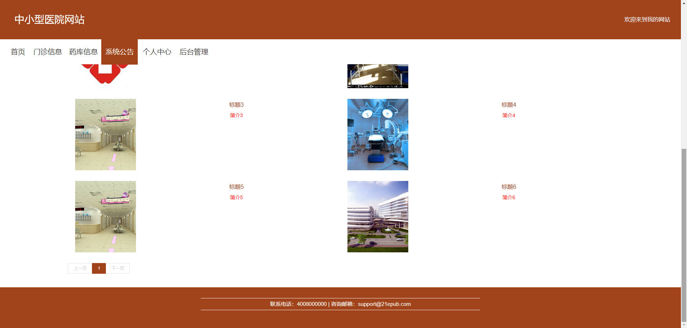

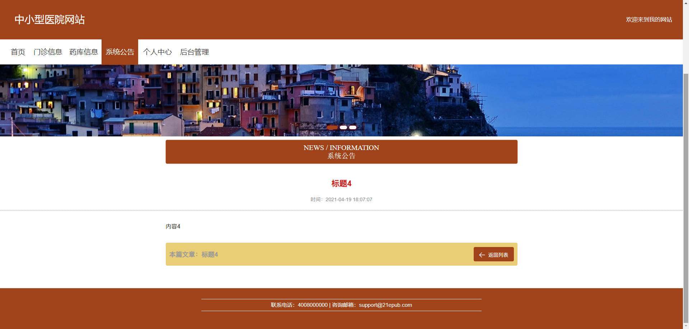

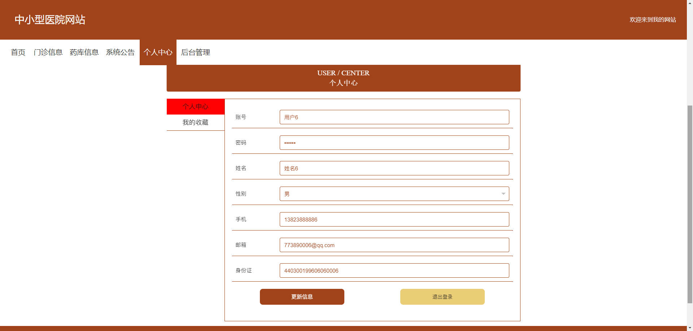

### 后台


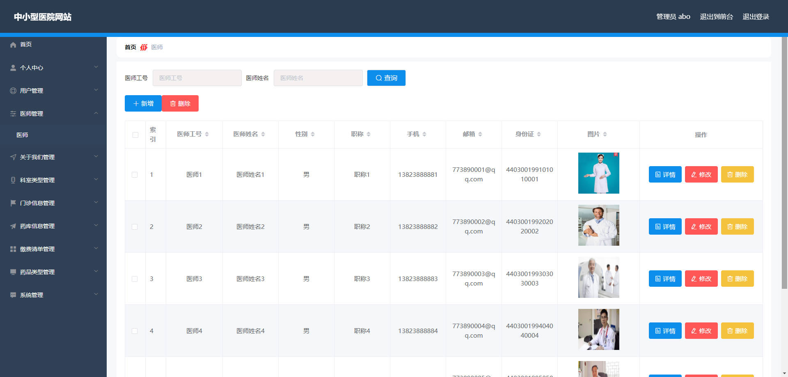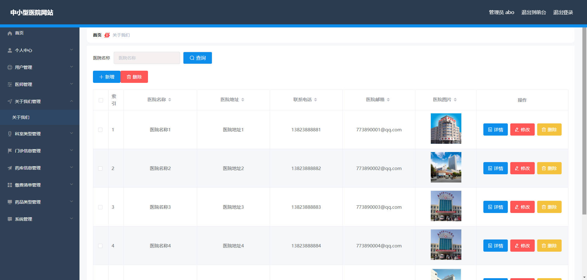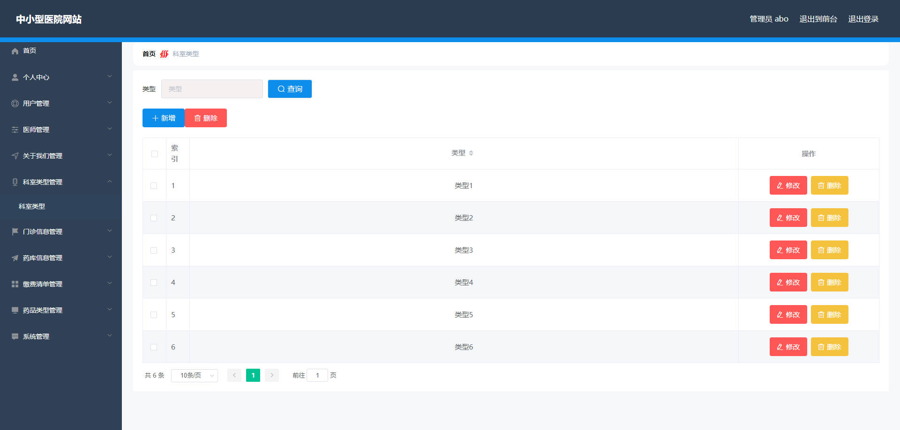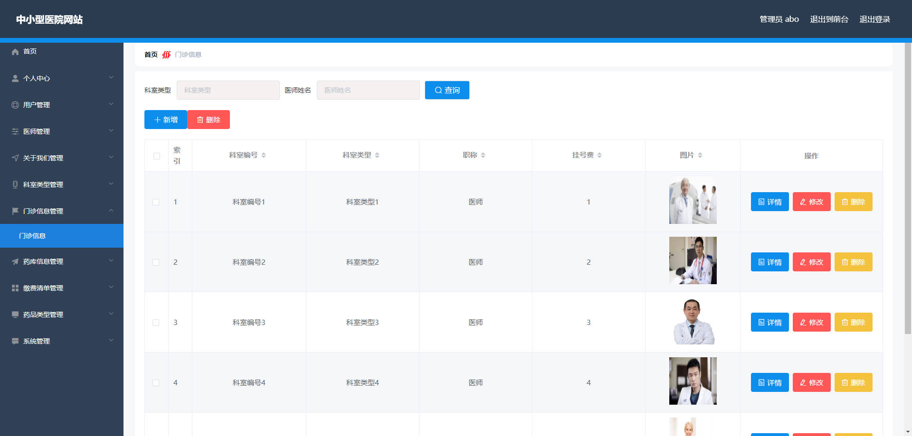

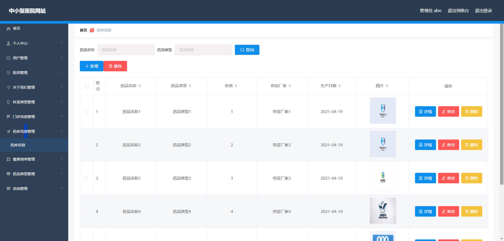

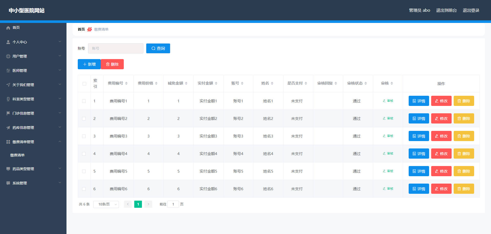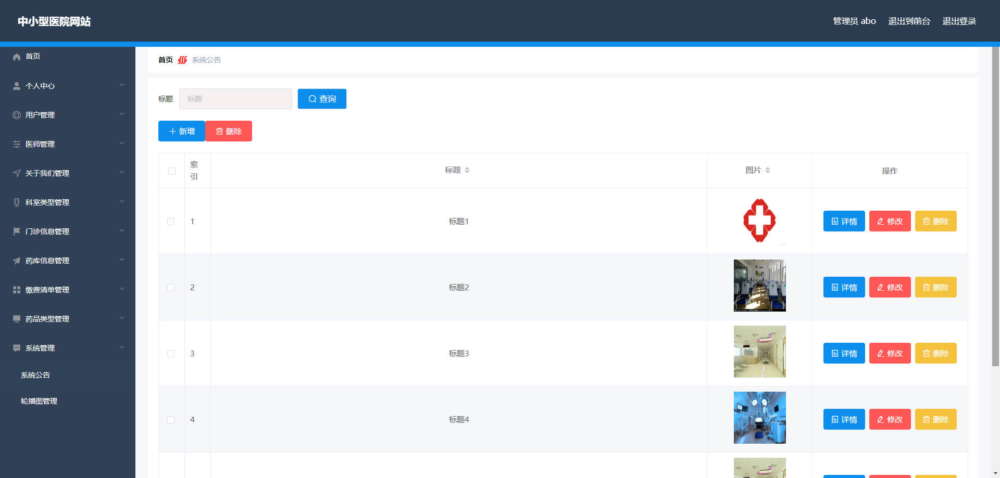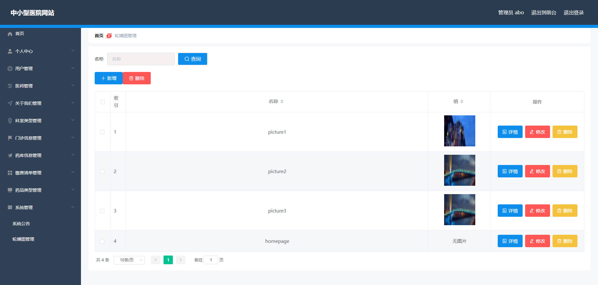

## 访问路径

### 前台

```properties
http://localhost:8080/springbootil5n0/front/pages/login/login.html

账号 用户6
密码 123456
```

### 后台

```properties
http://localhost:8080/springbootil5n0/admin/dist/index.html#/login

账号 abo
密码 abo
```


## 功能图

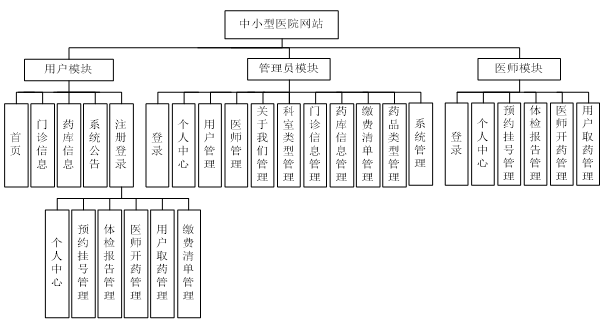


## 文档目录

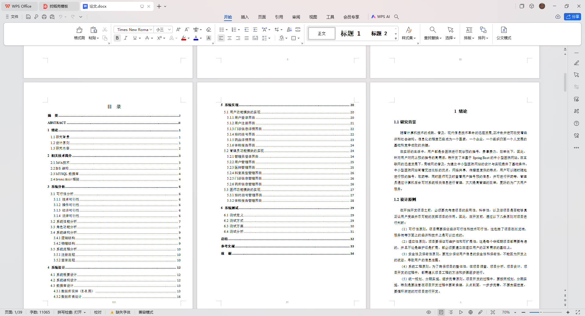


## 打赏或交流


